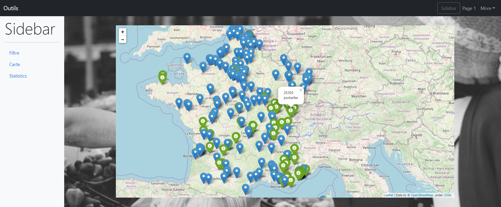

# Projet de web scrapping sur les prix des supermarchés

Les membres de l'équipe:
* Camille BAYON DE NOYER, 
* Sonia MOGHRAOUI, 
* Noor MAJED,
* Nicolas LEROUX

Durée du projet : 1 mois

> Quels sont les supermarchés les plus cher ? Dans quel magasin faut-il mieux aller pour payer ses courses moins cher ?

## Démonstration Interface graphique 

### Trouver le produit le moins cher de ma région

### Carte

### Analyse statistique

## Sources 

### Librairies
* Pandas - traitement de données
* Selenium - webscraping
* Dash - interface graphique
* nltk.tokenize - filtre

